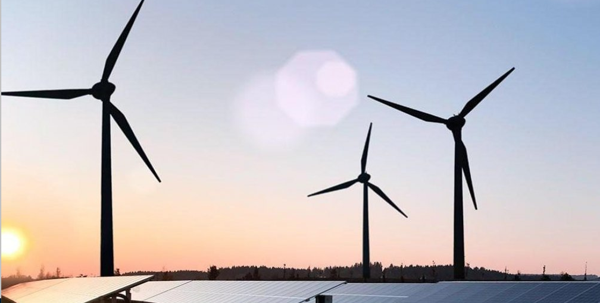

# T&T CONSULTING

Developer - David Gray

[Live webpage] (https://dave89gray.github.io/CI_PP1_TTC/)

Welcome to T&T Consulting. 
 
This is a website that showcases the expertise of Engineering Consultants and offers potential clients the opportunity to review past projects, see the skillset from consultants on offer and the chance to book consultation appointments so that T&T Consulting can fulfill the customers needs. 
 
This site is targeted towards Oil & Gas or Renewable Energy companies that manufacture turnkey projects and are looking for expertise in finding solutions to their issues.
There is a section dedicated to allowing the user to get to know some of the managers and employees to give them a better overall feeling about the website.
 
T&T’s portfolio of projects and their extensive experience is on view through the Projects section while the site also allows potential clients to submit their details and make a request for consultation.
 
Thank you for visiting my project. I am always looking to improve and learn so please feel free to go to my GitHub and reach out to me with any improvements or suggestions you may have.

## Table of Content

1. [Project Goals](#project-goals)
    1. [User Goals](#user-goals)
    2. [Site Owner Goals](#website-owner-goals)
2. [User Experience](#user-experience)
    1. [Target Audience](#target-audience)
    2. [User Requrements and Expectations](#user-requrements)
    3. [User Stories](#user-stories)
3. [Design](#design)
    1. [Design Choices](#design-choices)
    2. [Colour](#colours)
    3. [Fonts](#fonts)
    4. [Structure](#structure)
    5. [Wireframes](#wireframes)
4. [Technologies Used](#technologies-used)
    1. [Languages](#languages)
    2. [Frameworks & Tools](#frameworks-&-tools)
5. [Features](#features)
6. [Testing](#validation)
    1. [HTML Validation](#HTML-validation)
    2. [CSS Validation](#CSS-validation)
    3. [Accessibility](#accessibility)
    4. [Performance](#performance)
    5. [Device testing](#performing-tests-on-various-devices)
    6. [Browser compatibility](#browser-compatability)
    7. [Testing user stories](#testing-user-stories)
8. [Bugs](#Bugs)
9. [Deployment](#deployment)
10. [Credits](#credits)
11. [Acknowledgements](#acknowledgements)

## Website Goals

### User Goals:
- Finding a consultancy firm that they can feel confidence in and can trust.
- See the range of skills on offer.
- Gain a view on basic company work flow.
- View the type of projects that the consultancy can offer work on.
- A contact form that allows a user to detail an issue and get in contact.
- Find the contact details and location of the head office.

### Website Owner Goals:
- Increase the number of clients.
- Showcase the consultancy firm and its employees to build trust.
- Showcase the different parts of the engineering industry that we work in.
- Offer a way for new and existing customers to contact us through the Contact Form.
- Provide key contact information.

## User Experience

### Target Audience:
- Renewable Energy companies looking for consultants to work on their projects.
- Oil and Gas companies looking for consultants to work on their projects.
- Potential consultants looking for a new company to work for.

### User Requirements:
- An easy to use website that can be navigated without thinking.
- Professional layout that displays information useful to the users needs.
- Navigation menu links that work as expected.
- Social media links in the footer that work as expected.
- A layout that has no issues with accessibility.
- A contact form that will submit the information that has been input.
- Contact information and location details.

### User Stories

#### First-time User:
 - As a first time user i want to see what projects the business have previously worked on.
 - As a first time user i want to get to know the company principles.
 - As a first time user i want to see some of the employees that work there.
 - As a first time user i want to know where the head office is located.
 - As a first time user i want to be able to submit a form so my issue can maybe be resolved.

 #### Returning User:
 - As a returning user i want to find the contact details to call for returning work.
 - As a returning user i want to find the companies social media pages in the footer.
 - As a returning user i want to know who are some of the people that may work on my project.
 - As a returning user i want to find the location of the company through the google maps.

 #### Website Owner:
- As website owner i want users to gain a perpective of how the company works.
- As website owner i want users to see what areas of engineering we can help them with.
- As website owner i want users to see the faces of some of our employees.
- As website owner i want users to be able to contact us.

## Design

### Design Choices:
This website was designed with the idea to promote a professional and efficient company that can work in different industries while working to the highest standard.
There has been box-shading added to two pages, Meet the Team and Projects, so that these stand out.

### Colours:
The colors chosen were punchy, that stood out in contrast of each other. The background color throughout the website resembles a white chalk that evokes thoughts of whiteboards and chalk, staples of engineering companies while it provides good contrast. The other two colors primarily used resemble steel which is a major part of each industry that we work within. The contrast between these colors with the background color is excellent.

### Fonts:
Montserrat was used throughout the body of the website, while Roboto was used for the Navigation menu and for the headings. Montserrat lettering is said to have work, dedication, care, color, contrast, light and life, day and night which sounded very much like what T&T Consulting want to be seen as as a company. Roboto is said to have a mechanical skeleton which fitted the engineering while having natural reading rhythm which made it perfect for the heaadings and navigation menu. Sans Serif was used as a fall back should one of these fonts fail in a browser.

### Structure
The website is laid out in an easy to read, easy to follow manner where the information that we want to present stands out. The index page has an image of a warm evening with renewble energy equipment that is supposed to ellicit a positive feeling from the user. The Navigation menu and Footer are used throughout each page to give the user consistency and a familiar feeling when going through each page.
The website contains rour separate pages:
- A home page with a welcoming image and information about comapny work flows.
- An about us page that details company values and a section that allows to user to get familiar with some of the team.
- A projects pages that offers insight into the different areas of engineering that we offer.
- A contact us page that has a contact form, company contact information and a map that allows users to locate the office.

### Wireframes

Index

About Us

Projects

Contact Us

### Languages
- HTML
- CSS

### Frameworks & Tools
- Git
- GitHub
- Gitpod
- Balsamiq
- Google Fonts
- Font Awesome
- Favicon

## Features

### Features Common to all pages

#### Title:

- The title states the name of the company at the top and center of the page.
- The title serves as a navigation link to the Home page as is standard convention and is expected by the user.

#### Navigation Menu:

- The navigation menu contains links to the Home, About Us, Projects and Contact Us pages to llow the user to navigate through the website smoothly.
- The active page that the user is on will be underlined as shown in the image above.
- The hover over feature has been added which will underline the page link that the user is hovering over while the cursor changes to a pointer.

### Features for Index page:
#### Welcoming Image:

- The index page has an image of a warm evening with renewble energy equipment that is supposed to ellicit a positive and hopeful feeling from the user. With Renewable Energy being at the forefront of decision makers minds, this image is also aiming to show that we have the experience and skills to deal with any requests.

#### Company Slogan:

- The company slogan has been added just underneath the header so that it is always there for the user to see.

- This section has been added to give an overview of the basic work flow of the company so they have a partial idea of what to expect when we work together.

### Features for About Us page:
#### Company Values:

- Company values have been added to this page so it firmly lays out who the company is and what standards that the user can expect from us should we work together.

- Company employees have been shown as this can build familiarity and trust before even starting to work together. The user can put a face to a name and also see the credentials of some of the team.

### Features for Projects page:

- The project section shows the company portfolio of projects and the varying industries that we can offer our expertise on. This is showcasing our skills as a company.

### Features for Contact Us page:

- The contact form is a way for the user to leave their details and submit a request for a consultation to see how we can help them solve their issue.

- This is information about the office including phone number, email address and office address

- The google maps is embedded into the page so the user can see the location of the office and find us if necessary.

## Validation

### HTML Validation
The website https://validator.w3.org/ offers the W3C Markup validation Service that was used to validate the HTML of the website. The result was that there were no errors or warnings to be aware of.

HTML

### CSS Validation
The website https://jigsaw.w3.org/css-validator/ offers the W3C Jigsaw CSS validation service that was used to validate the CSS of the website. The result was that there were no errors or warnings to be aware of.

style.css

### Accessibility
The website https://wave.webaim.org/ offers the WAVE WebAIM web accessibility evaluation tool that was used to evaluate the overall accessiblity of the website and ensure that it met the highest standards. The website passed with 0 errors.

Home

About Us

Projects

Contact Us

